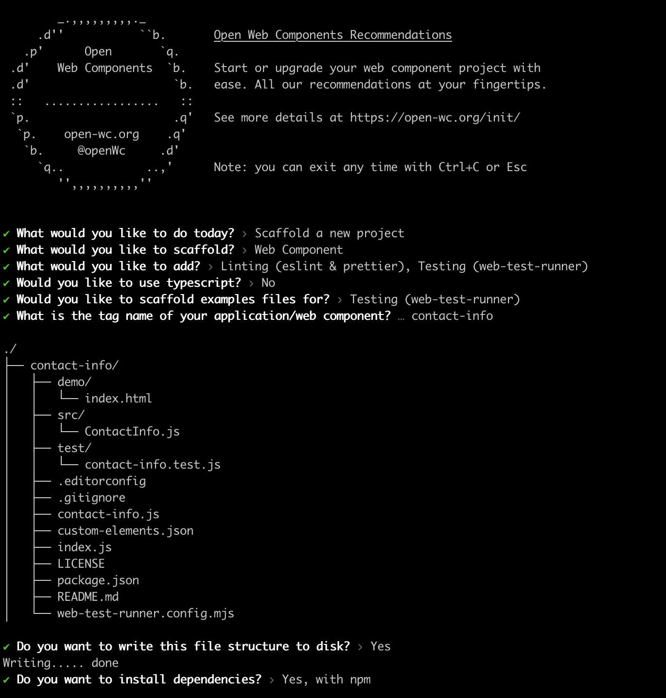
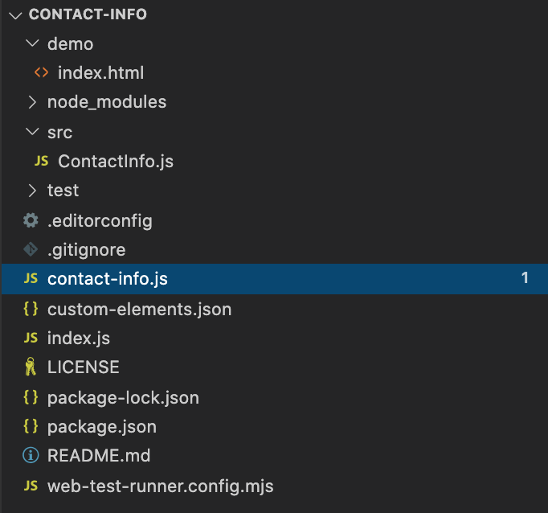
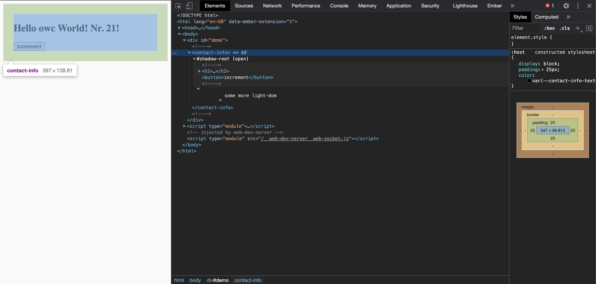

authors: Julian Pérez / Ivan De Gracia
summary: Primeros pasos con LitElement
id: intro-curso-litelement
categories: web
tags: codelab,litelement
status: Draft

# Primeros pasos con LitElement

Este codelab está orientado a aprender a usar LitElement.
LitElement es una clase base simple para crear componentes web que funcionan en cualquier navegador web de la actualidad.

LitElement usa lit-html para renderizar en el *Shadow DOM* y agrega una API para administrar propiedades y atributos. Las propiedades se observan de forma predeterminada y los elementos se actualizan de forma asincrónica cuando cambian sus propiedades.

## Objetivo
Duration: 00:30

Nuestro objetivo con esta formación es que aprendas todo lo necesario para que puedas empezar a desarrollar componentes usando LitElement

## ¿Qué conocimientos deberías conocer?
Duration: 00:30

* Conocimientos básicos sobre Javascript, HTML y CSSS
* Algo de experiencia con [WebComponents](https://developer.mozilla.org/es/docs/Web/Web_Components) y con [lit-html](https://lit-html.polymer-project.org/)
* Algo de experiencia con [Node.js](https://nodejs.org/es/) y [npm](https://npmjs.org/)

Positive
: Lit-html nos permite escribir *templates* HTML en JavaScript utilizando *template strings*. Lit-html identifica las partes estáticas y dinámicas de las *templates* para que pueda actualizar de manera eficiente solo las partes modificadas del DOM.

## ¿Qué necesitarás?
Duration: 01:00

* Un ordenador con acceso a una terminal
* Conexión a internet
* Tener instalado [Node.js](https://nodejs.org/es/) (versión 10 o superior)
* Instalar el paquete npm de LitElement: ```npm i -g lit-element```
* Cualquier editor de texto ([Visual Studio Code](https://code.visualstudio.com/), [Atom](https://atom.io/), vim...)

## Creación del proyecto de desarrollo desde cero
Duration: 03:00

Primero, crearemos la carpeta de nuestro proyecto curso-litelement

```console
mdkir curso-litelement
```

A continuación nos movemos a la carpeta creada y lanzaremos el siguiente comando npm:

```console
cd curso-litelement
npm init @open-wc
```

Este generador nos ayudará a crear la estructura (scaffolding) de una nueva aplicación o componente web.
Para esta primera parte del codelab seleccionaremos la opción ``Scaffold a new project`` y ``Web component``. Llamaremos a nuestro Web component ``contact-info``



Una vez finalizada la instalación de las dependencias, deberíamos ver este mensaje por consola indicando que el proyecto se ha generado correctamente

```console
You are all set up now!

All you need to do is run:
  cd contact-info
  npm run start
```

Una vez generado el proyecto tendremos uan estructura de ficheros y directorios como esta:



Si lanzamos el servidor con `npm run start` se nos abrirá en nuestro navegador una página **index.html**. Si inspeccionamos el DOM del index.html generado observamos que se está renderizando una etiqueta html llamada `<contact-info>`, que es el nombre que habíamos elegido para nuestro componente.

