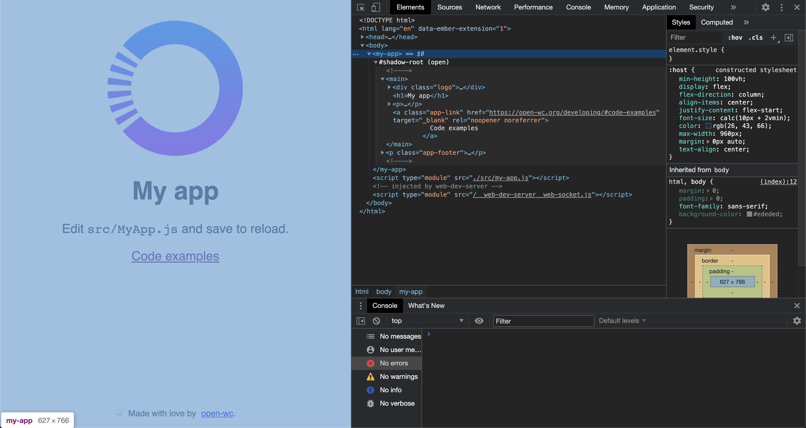

authors: Julian Pérez / Ivan De Gracia
summary: Introducción
id: intro
categories: web
tags: codelab,litelement
status: Draft

# Introducción

Nuestro objetivo con esta formación es que aprendas todo lo necesario para que puedas empezar a desarrollar componentes usando LitElement.

LitElement es una clase Javascript para crear componentes web (4.4Kb)

LitElement usa la librería lit-html para renderizar en el *Shadow DOM* y agrega una API más *amigable* para administrar propiedades y atributos, estilos y eventos.Las propiedades se observan de forma predeterminada y los elementos se actualizan de forma asincrónica cuando cambian sus propiedades, optimizando el repintando de la página.

Positive
: Exiten otras muchas librerías para generar componentes web [Comparativa librerías](https://webcomponents.dev/blog/all-the-ways-to-make-a-web-component/)

Toda la documentación oficial de `LitElement` la podrás encontrar [aquí](https://lit-element.polymer-project.org/guide)

## ¿Qué conocimientos previos deberías tener?

Duration: 00:30

* Conocimientos básicos sobre Javascript, HTML y CSS
* Algo de experiencia con [Web Components](https://developer.mozilla.org/es/docs/Web/Web_Components) y con [lit-html](https://lit-html.polymer-project.org/)
* Algo de experiencia con [Node.js](https://nodejs.org/es/) y [npm](https://npmjs.org/)

## ¿Qué recursos necesitarás?

Duration: 01:00

* Un ordenador con acceso a una terminal
* Conexión a internet
* Tener instalado [Node.js](https://nodejs.org/es/) (versión 10 o superior)
* Cualquier editor de texto ([Visual Studio Code](https://code.visualstudio.com/), [Atom](https://atom.io/), vim...)

## ¿Qué aprenderás con esta formación?

Duration: 01:00

* Repaso a los conceptos de Web Components
* Funciones de la clase LitElement

## Creación de un proyecto de desarrollo

Duration: 05:00

Para el desarrollo de la formación, en primer lugar nos crearemos la carpeta de nuestro proyecto llamada `curso-litelement`

```console
mdkir curso-litelement
```

A continuación nos movemos a la carpeta creada y lanzaremos el siguiente comando npm:

```console
cd curso-litelement
npm init @open-wc
```

Este generador que nos proporciona la comunidad [open-wc](https://open-wc.org/) nos ayudará a crear la estructura o *scaffolding* de una nueva aplicación o componente web.
Para estos primeros ejercicios seleccionaremos la opción ``Scaffold a new project`` y ``Aplication``.

Negative
: El nombre de nuestro componente debe contener al menos un guión `-`

```console
npx: instaló 30 en 20.672s

        _.,,,,,,,,,._
     .d''           ``b.       Open Web Components Recommendations
   .p'      Open       `q.
 .d'    Web Components  `b.    Start or upgrade your web component project with
 .d'                     `b.   ease. All our recommendations at your fingertips.
 ::   .................   ::
 `p.                     .q'   See more details at https://open-wc.org/init/
  `p.    open-wc.org    .q'
   `b.     @openWc     .d'
     `q..            ..,'      Note: you can exit any time with Ctrl+C or Esc
        '',,,,,,,,,,''


✔ What would you like to do today? › Scaffold a new project
✔ What would you like to scaffold? › Application
✔ What would you like to add? › Linting (eslint & prettier), Testing (web-test-runner)
✔ Would you like to use typescript? › No
✔ Would you like to scaffold examples files for? › Testing (web-test-runner)
✔ What is the tag name of your application/web component? … my-app

./
├── my-app/
│   ├── src/
│   │   ├── my-app.js
│   │   ├── MyApp.js
│   │   └── open-wc-logo.js
│   ├── test/
│   │   └── my-app.test.js
│   ├── .editorconfig
│   ├── .gitignore
│   ├── custom-elements.json
│   ├── index.html
│   ├── LICENSE
│   ├── package.json
│   ├── README.md
│   └── web-test-runner.config.mjs

✔ Do you want to write this file structure to disk? › Yes
Writing..... done
✔ Do you want to install dependencies? › Yes, with npm

Installing dependencies..
```

Una vez finalizada la instalación de las dependencias, deberíamos ver este mensaje por consola indicando que el proyecto se ha generado correctamente.

```console
You are all set up now!
```

Psitive:
: Puedes abrir al archivo *package.json* para ver las dependencias instaladas; entre ellas encontrarás el paquete de **lit-html** y **lit-element**

Para lanzar nuestra applicacion ejecutaremos:

```console
  cd my-app
  npm run start
```

## Registro del componente web en el navegador

Duration: 03:00

Si abrimos el fichero ``./src/MyApp.js`` observamos que nuestro componenente llamado `MyApp` extiende de la clase `LitElement`.

```js
import { html, css, LitElement } from 'lit-element';

export class MyApp extends LitElement {
  ...
}
```

Al arrancar el servidor de nuestro proyecto, se abrírá en nuestro navegador una página **index.html**. Si inspeccionamos el DOM de la página generada veremos que se está renderizando una código HTML dentro de la etiqueta `<my-app>`.



Para que el navegador pueda entender lo que significa la etiqueta `my-app` nuestro componente está registrado como un [*custom element*](https://developer.mozilla.org/es/docs/Web/Web_Components/Custom_Elements). 

Este registo se ha declarado en el fichero `./my-app.js` de nuestro proyecto.

```js
import { MyApp } from './src/MyApp.js';

customElements.define('my-app', MyApp);
```
